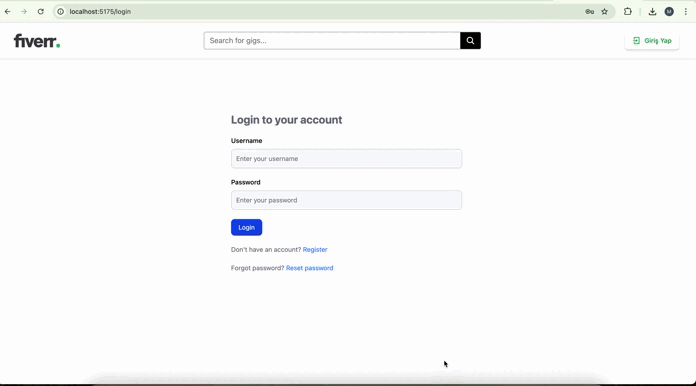

# 🚀 Full-Stack Fiverr Clone Project 
I've developed a comprehensive freelance marketplace platform using modern web technologies. Here are the technical details:

# 🛠️ Tech Stack:
Frontend: React 19, Vite, TailwindCSS, React Query

Backend: Node.js, Express.js, MongoDB, Mongoose

Authentication: JWT, bcrypt, password reset functionality

File Upload: Cloudinary integration, Multer

Email Service: Nodemailer with Mailtrap

State Management: React Context API

# ✨ Key Features:
User Authentication: Register/Login with JWT tokens

Role-based Access: Buyer/Seller differentiation

Gig Management: Create, edit, delete services with image uploads

Advanced Search: Category filtering, price range, text search

Sorting System: By price, rating, date, reviews

Responsive Design: Mobile-first approach

Real-time Notifications: Toast notifications

Password Recovery: Email-based reset system

# 🎯 Business Logic:
Multi-category service marketplace (9 categories)

Package-based pricing system

Rating and review system

Image gallery with carousel

Protected routes and middleware

Form validation and error handling

# 📱 Modern UX/UI:
Clean, professional interface

Intuitive navigation

Loading states and error handling

Responsive grid layouts

Interactive components

This project demonstrates modern web development best practices, RESTful API design, and scalable architecture.
# Preview of the Project

